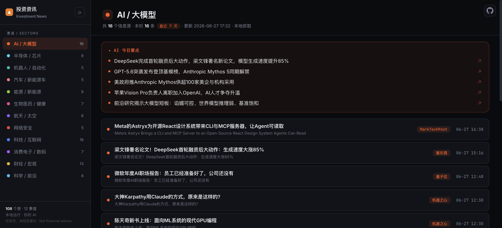

<p align="center"><b>简体中文</b> | <a href="README_en.md">English</a></p>

<h1 align="center">Investment News · 投资资讯</h1>

<p align="center">
  <b>为 A股投资者追踪全球产业链领先信号 —— 12 大赛道一一对应 A股板块，覆盖 100+ 权威源，AI 每日提炼为中文要点，全程本地、零 API key。</b><br>
  Tracking the global industry signals behind China A-share sectors — 12 sectors mapped to A-share themes, 100+ authoritative sources, distilled into daily Chinese key points by your own AI, fully local, zero API key.
</p>

<p align="center">
  
  
  
  
  
  
  
</p>

<p align="center">
  <a href="#这是什么">这是什么</a> ·
  <a href="#能力-features">能力</a> ·
  <a href="#快速开始">快速开始</a> ·
  <a href="#工作原理">工作原理</a> ·
  <a href="#配置大模型订阅--api-二选一">配置大模型</a> ·
  <a href="#覆盖赛道与信息源">覆盖赛道</a>
</p>

---

## 这是什么

**Investment News 是为 A股投资者打造的全球产业链资讯看板。** 半导体、AI、机器人、新能源车、航天…这 12 大赛道一一对应 A股板块，而真正驱动板块的领先信号，往往先出现在全球英文源里。本工具覆盖全球 100+ 权威信息源，调用你自己的大模型，将各赛道最新动向每日提炼为中文「今日要点」并完成翻译，统一呈现在一个本地浏览器看板中。

区别于信息过载的新闻聚合器，其核心在于**由 AI 完成阅读与提炼**：每个赛道置顶 3–5 条「今日要点」，跨源聚合去重，便于快速把握各赛道全貌，并可下钻至原文核实。抓取过程在**本地**完成（纯 Python 标准库），AI 使用**你自己**的 Claude 订阅（$0）或任意 API key，**数据全程留存本机，无需账号，无托管依赖**。

适用场景：

- A股投资者跟踪半导体、AI、新能源车、机器人等板块的全球先行信号，但海外资讯多为英文、且分散在上百个源——本工具把它们汇成一屏中文要点。
- 需同时跟踪多个投资赛道，但资讯庞杂、难以尽读，且多为英文。
- 门户与聚合器提供的是离散信息流；真正需要的是「该赛道当日的核心进展」—— 这正是 AI 要点层的职责。

> 📊 **本工具呈现的是行业动向与领先信号，并非行情数据，更不构成投资建议。** Industry trends, **not financial advice**.

## 能力 Features

| 能力 | 说明 |
|---|---|
| **今⁠日⁠要⁠点** | 每个赛道置顶 3–5 条中文要点，跨源聚合去重、提炼核心公司与数据，由本地大模型生成 |
| **双⁠语⁠呈⁠现** | 英文标题自动译为中文，中文为主、原文备查，无需英文阅读能力即可掌握 |
| **覆⁠盖⁠赛⁠道** | AI/大模型 · 半导体/芯片 · 机器人/自动化 · 汽车/新能源车 · 能源/新能源 · 生物医药/健康 · 航天/太空 · 网络安全 · 科技/互联网 · 消费电子/数码 · 财经/宏观 · 科学/前沿 |
| **要⁠点⁠溯⁠源** | 每条要点附原文链接，可一键回溯至主要信息来源 |
| **一⁠键⁠刷⁠新** | 看板内触发抓取与摘要，执行完成后自动刷新，无需命令行操作 |
| **引⁠擎⁠双⁠选** | 支持本机 Claude 订阅（`claude-cli`，$0）与任意 OpenAI 兼容 API 两种接入，单一配置项切换 |
| **本⁠地⁠运⁠行** | 抓取与呈现均在本地完成，数据全程留存本机；无数据库、无托管、无 RSSHub |
| **合⁠规⁠过⁠滤** | 内置关键词过滤，自动剔除博彩、预测市场、加密货币、色情类内容；时政、财经正常收录 |

## 截图 Screenshot



> **本工具的核心交付物是这个浏览器看板。** 运行后，所有操作的终点都是访问 `http://localhost:8793` —— 今日要点、中文翻译、赛道分区、原文跳转，均集中于该页面。

## 快速开始

**环境要求**：Python 3.7+（标准库即可，**无需安装任何第三方包**）+ 一个大模型（下方二选一）。

```bash
git clone https://github.com/simonlin1212/investment-news.git
cd investment-news

# 1) 配置大模型(见下「配置」)，默认使用本机 Claude 订阅，零成本
# 2) 启动看板服务
python3 server.py            # 默认端口 8793，保持运行
# 3) 在浏览器打开看板
open http://localhost:8793   # Windows 使用 start，Linux 使用 xdg-open
# 4) 点击左上角 ⟳，触发抓取与 AI 摘要，完成后自动刷新
```

### 网络环境（海外源抓不动时看这里）

106 个源里大部分是海外媒体。在直连不畅的网络下，会看到抓取结束时打印「N/106 个源抓取失败」。两个可调项：

```bash
# 走代理：urllib 原生读这两个环境变量，无需改代码
export HTTPS_PROXY=http://127.0.0.1:7897
export HTTP_PROXY=http://127.0.0.1:7897

# 放宽单源超时（默认 30 秒），链路差时可以再加
export FETCH_TIMEOUT=45

python3 server.py
```

> 从看板按 ⟳ 触发时，子进程会继承你启动 `server.py` 那个 shell 的环境变量，所以代理要在启动前 export。
>
> **不建议关闭证书校验。** 如果大量源报 `CERTIFICATE_VERIFY_FAILED`，通常是本机证书链的问题而非本项目的：macOS 上用 python.org 安装包装的 Python 需要先跑一次 `Install Certificates.command`；走 MITM 代理则需要把代理的根证书装进系统信任。这些都比全局关掉校验安全。

## 工作原理

```
sources.json  (108 个源 / 12 赛道)
       │
       ▼  scripts/fetch.py    抓取 + 合规过滤 + 最近 N 天 + 北京时间归一
  data.js  (原始条目)
       │
       ▼  scripts/digest.py   调用你的大模型 → 各赛道「今日要点」+ 中文翻译 + 溯源链接
  data.js  (含 AI 要点)
       │
       ▼  index.html          浏览器看板(单文件、零构建、零依赖)
  server.py：本地服务 + 刷新接口 /api/refresh
```

全流程基于**纯 Python 标准库 + 一个大模型**，无数据库、无 RSSHub、无托管服务。`claude-cli` 模式下，`digest` 调用本机 `claude -p`（订阅鉴权、禁用全部工具、仅处理文本），**仅本地可用、零成本**。

## 配置大模型（订阅 / API 二选一）

编辑 `llm.config.json`：

| provider | 说明 | 成本 |
|---|---|---|
| **`claude-cli`（默认）** | 使用本机已登录的 **Claude Code 订阅**（仅需 `claude login` 一次），本地可用 | **$0** |
| **`api`** | 任意 **OpenAI 兼容 API**（DeepSeek / OpenAI / 硅基流动 / OpenRouter…），任意环境可用 | 按量计费 |

```jsonc
{ "provider": "claude-cli" }                       // 使用订阅，无需额外配置
// 或
{ "provider": "api",
  "api": { "base_url": "https://api.deepseek.com", "api_key": "sk-...", "model": "deepseek-chat" } }
```

## 覆盖赛道与信息源

12 大赛道、108 个精选源，**英文权威媒体与中文垂直媒体并重**，例如：

- **AI/大模型**：OpenAI · Google Research · Hugging Face · 量子位 · 机器之心 · 智东西 · MIT Tech Review
- **半导体/芯片**：DIGITIMES · SemiAnalysis · IEEE Spectrum · EE Times · Semiconductor Engineering
- **机器人 / 汽车 / 能源**：The Robot Report · IEEE Spectrum · Electrek · InsideEVs · CleanTechnica · 国际能源网
- **生物医药 / 航天 / 安全**：STAT · Endpoints · SpaceNews · NASA · Krebs on Security · BleepingComputer
- **科技 / 财经**：TechCrunch · The Verge · Ars Technica · 虎嗅 · 36氪 · 钛媒体 · FT · CNBC · 华尔街见闻 · 东方财富

> 完整清单见 `sources.json`。增删或修复信息源，仅需编辑该文件。

## 新增信息源 = 增加一行

在 `sources.json` 的 `sources` 数组中增加一行即可，无需改动代码：

```jsonc
{ "name": "某媒体", "hint": "ai", "type": "rss", "url": "https://example.com/feed" }
```

`hint` 为赛道标识（ai / semi / robot / auto / energy / bio / space / security / tech / consumer / macro / science）。
`fetch.recent_days` 控制时间窗口（默认 7 天）；`redline_keywords` 为合规过滤词表。

## 项目结构

```
investment-news/
├── index.html          浏览器看板(侧栏 12 赛道 + 今日要点 + 双语列表 + 刷新)
├── server.py           本地服务 + /api/refresh
├── sources.json        108 源 / 12 赛道 / 合规词(调整源即编辑此文件)
├── llm.config.json     大模型 provider(订阅 / API)
├── data.js             生成的数据(fetch + digest 产出)
├── scripts/
│   ├── fetch.py        抓取 + 合规过滤 + 时间窗口(纯标准库)
│   ├── digest.py       调用大模型生成「今日要点」与翻译
│   ├── llm.py          统一大模型入口(claude-cli / api 双 provider)
│   └── build_sources.py 重建并校验 sources.json(逐源 liveness 实测)
└── docs/screenshot.png
```

## 技术栈与依赖

- **Python 3.7+**，**纯标准库**（urllib / json / xml.etree / http.server / subprocess）—— 抓取与看板零第三方依赖。
- **一个大模型**：本机 Claude Code 订阅（`claude-cli`，$0），或任意 OpenAI 兼容 API key。
- 需联网访问信息源（部分国际源可能需要代理）。

## 使用边界 / 免责声明

- **仅本地运行**：不含任何托管、上传或服务端，数据仅留存于本机。
- **仅读取公开 RSS / 接口**，保持低频访问，并遵守各信息源的服务条款。
- **结论仅供参考**：本工具属**资讯聚合**，所呈现的是行业动向与领先信号，**不构成任何投资建议**；据此决策的后果由使用者自行承担。

本软件依 [MIT 许可](LICENSE) 以「现状」提供，不附带任何形式的担保。

## 赞赏

如果这个工具帮到了你，欢迎请作者喝杯咖啡。

<p align="center">
  <a href="https://buymeacoffee.com/simonlin1212"></a>
</p>

## License

[MIT](LICENSE)

一个将全球行业资讯提炼为中文要点的本地看板。欢迎提交 PR 补充更多赛道与信息源。

**作者：** Simon 林 · X [@linsizhen](https://x.com/linsizhen) · 邮箱：[simonlin0423@gmail.com](mailto:simonlin0423@gmail.com)
